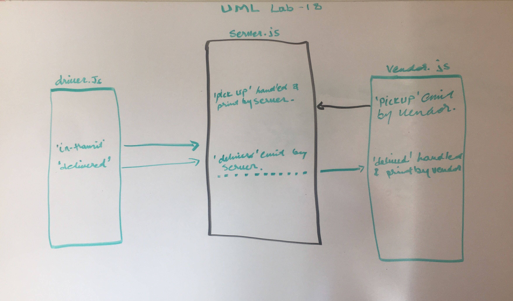

## LAB - Class 18

* Author: *Eyob Tamir*

* Links and Resources
[Submittion PR](https://github.com/eyobtamir-401n16/lab-18/pull/2) 

* Applications

`pickup - Tells the system when a new order needs to be delivered`

`in-transit - Tells the system which order is in the process of being delivered`

`delivered - Tells the system when the order has been delivered`

*  How to initialize/run your application 
 `npm start` || `nodemon`

* Tests (Not applicable)

* UML 
